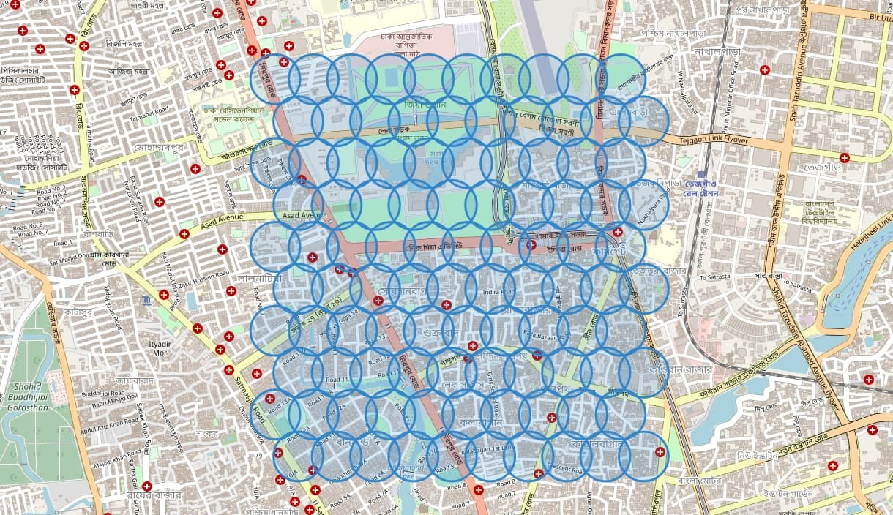
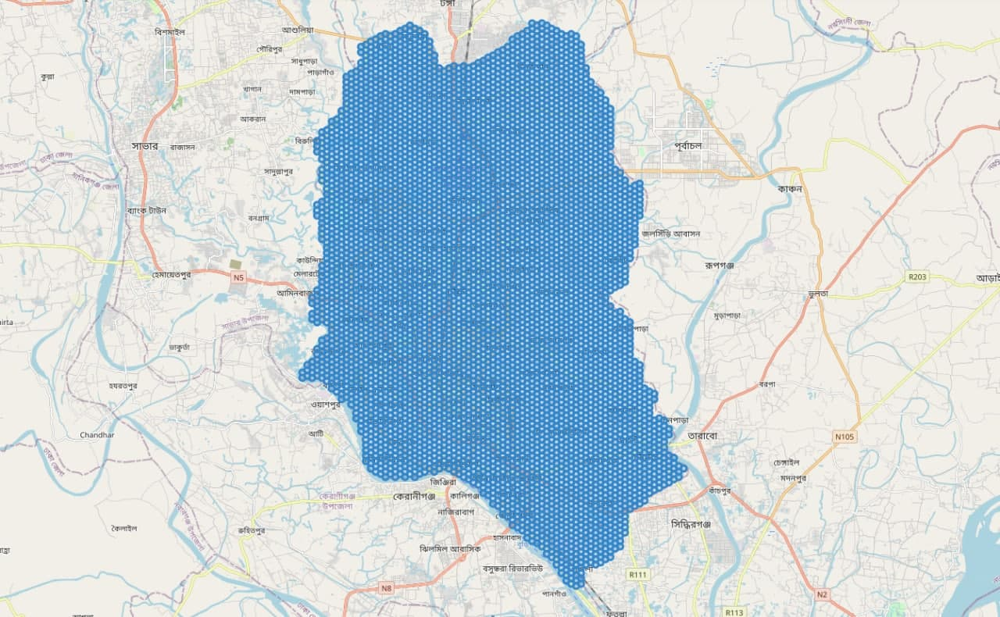
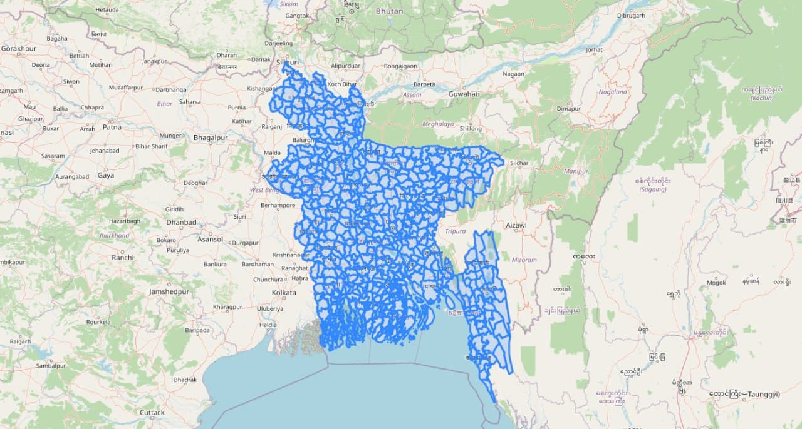

# Scraping Restaurant Data using Google Places API

The Goal of this Project is *to collect data from restaurants all over Bangladesh using the Google Places API.*

The following data is collected for each restaurant:
- Name
- Place_id (Unique identifier to Google Maps)
- Location (Latitude & Longitude)
- Rating (on a scale of 5)
- No. of Reviews/Ratings
- Price Level ($/$$/$$$/$$$$)

If a data point is not available i.e. rating/reviews/price level, it is replaced with 'N/A'

# Project Organization: 

The different steps of the project are organized into a few different notebooks: 

1. [data_scraping_places_API](https://github.com/sadiatanjim/restaurant-data-scrape/blob/main/1_data_scraping_places_api.ipynb)
2. [generate_data_points](https://github.com/sadiatanjim/restaurant-data-scrape/blob/main/2_generate_data_points.ipynb)
3. [collect_data_by_district(final)](https://github.com/sadiatanjim/restaurant-data-scrape/blob/main/3_collect_data_by_district(final).ipynb)

## Data Scraping using Places API

Data Scraping is performed using the Google Places API. We use the `nearby search` request of the Google Places API.

- We first try to collect restaurant data around a random point in Dhaka, Bangladesh using an API call
- The response is processed to extract relevant Data as a Python Dictionary with the function `get_loc_data()`
- Multiple pages of response can be extracted using the `next_page_token` in the function `get_nearby_locs()`
- The optimum radius of search in Dhaka was determined to be 150 meters. 

## Generate Data Points/Search Bubbles

With the optimal search radius of 150 meters, we can define search bubbles throughout geographic co-ordinates.

- A uniform grid of search bubbles are visualized with folium
- A more efficient hexagonal grid is realized

Before demonstrating on the whole country, we would like generate data points/search bubbles for Dhaka first. 

Geometric boundaries are usually defined in GeoJSON files. The GeoJSON file for Dhaka is collected from the following Link: [dhaka.geojson](https://gist.github.com/EmranAhmed/e1f1da00b6677aed023a) 

- The geojson file is processed
- An overlapping grid of data points/search bubbbles is generated for the search
- The search grid is visualized
- We write the function `get_all_points()` which takes a geographic polygon as input and returns a list of search co-ordinates within the bounds of the polygon

## Collect Data By Districts

**Bangladesh GeoJSON**:

Data for the whole country can be found through the Governement website: [GeoDash](https://geodash.gov.bd/)  

The same data is also available as a [Github Repository](https://github.com/fahimxyz/bangladesh-geojson)

- Data from the Bangladesh GeoJSON file is used to collect data by district/subdistrict and store them in csv files
- Later Data from the csv files is combined to generate the final results. 
- Due to limits in API Calls, we were only able to collect data from Dhaka & Chittagong District. 

## Sample Results: 

Sample results can be found in [results_merged.csv](https://github.com/sadiatanjim/restaurant-data-scrape/blob/main/data/results_merged.csv)

Result Format: 

|Field|Description|
|--------|-----------|
|name|Name of Restaurant|
|place_id|Unique identifier for place in Google Maps|
|latitude|Latitude|
|longitude|Longitude|
|rating|Rating (on a scale of 5)|
|user_ratings_total|No. of Reviews/Ratings|
|price_level|Affluence/price Level of restaurant|

`N/A` used for missing values. 

## Conclusion & Next Steps: 

- We can use the above technique to collect data from all over Bangladesh and store them district-wise.
- Later, the district-wise data can be combined to create a merged file to contain information of all the restaurants in Bangladesh.
- However, there is room for improvement in efficiency and we can also reduce the number of API calls. We can use a larger search area for less populous regions. However, due to time limitation, we did not try out these ideas. 

### Sample Code for Data Collection all over Bangladesh: 

You can find it in the repository here: 

[collect_bd_data.py](https://github.com/sadiatanjim/restaurant-data-scrape/blob/main/collect_bd_data.py)

[utils.py](https://github.com/sadiatanjim/restaurant-data-scrape/blob/main/utils.py) Contains the helper functions for this project. 

## Requirements: 

The list of required libraries can be found in: [requiremnts.txt](https://github.com/sadiatanjim/restaurant-data-scrape/blob/main/requirements.txt)